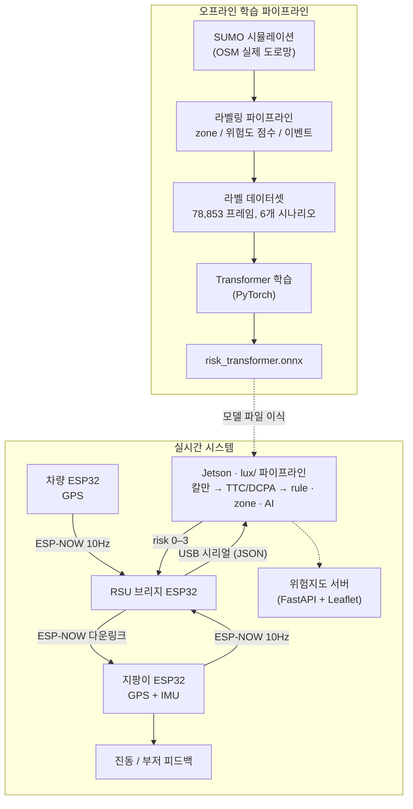
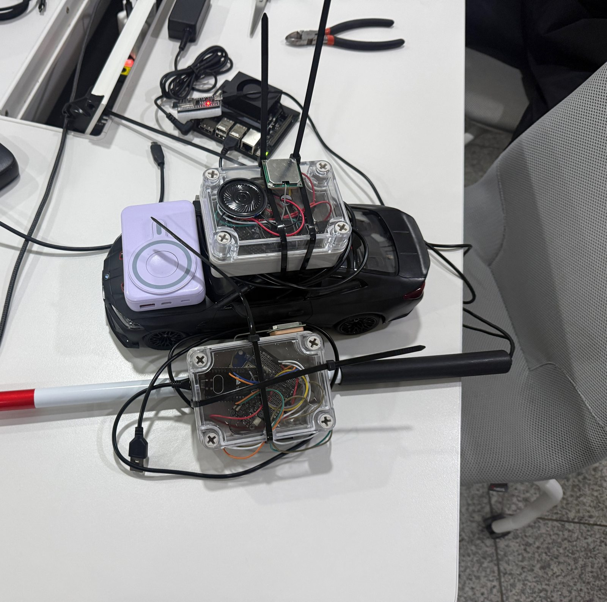
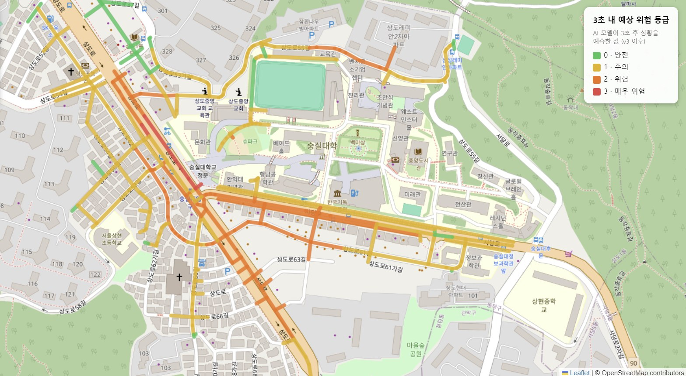
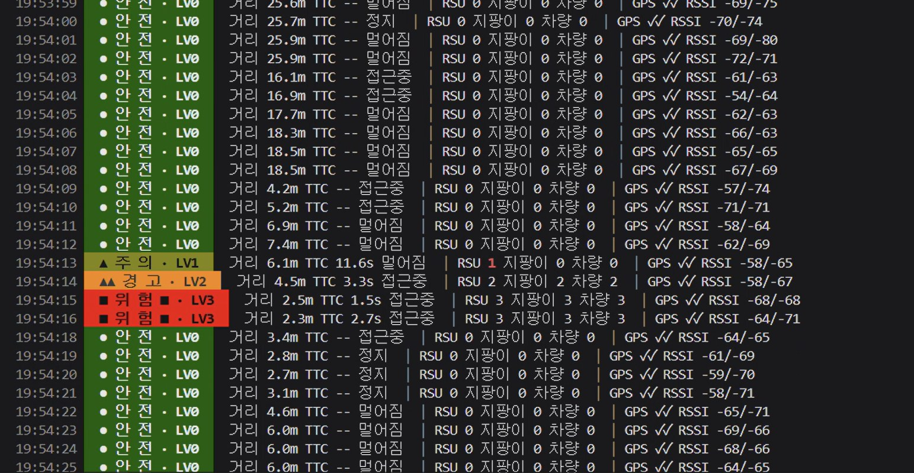
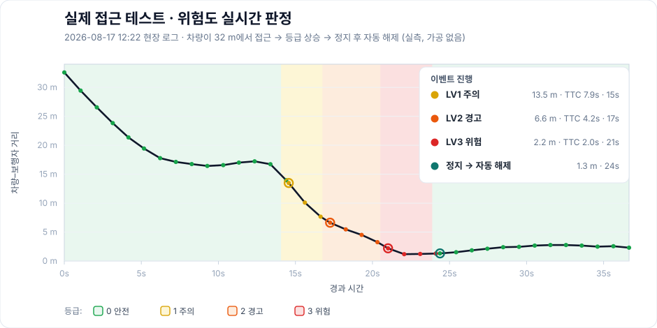

<div align="center">

# 🦯 AI-V2X Smart Cane

**AI 기반 V2X 협력형 시각장애인 보행 안전 지팡이<br/>접근하는 차량을 실시간으로 감지해 진동·부저로 경고합니다.**

     

🇺🇸 [English version](README.md)

</div>

지팡이와 주변 차량이 각자 GPS 위치를 ESP-NOW로 10Hz 브로드캐스트하면, 노변 장치(RSU)가 이를 모아 NVIDIA Jetson에 전달합니다. Jetson은 칼만 필터 기반 거리·TTC·DCPA로 충돌 위험도(0~3)를 판정해 지팡이로 되돌려 보내고, 지팡이는 등급별 진동·부저 패턴으로 사용자에게 경고합니다. 사용자 쪽에는 스마트폰도, 네트워크 연결도 필요 없습니다.

**한이음 ICT 멘토링** 프로젝트로 4인 팀이 개발했습니다.

## 시스템 아키텍처



## 위험도 판정 방식

Jetson 쪽 파이프라인(`lux/`)은 서로 독립적인 세 가지 위험원을 계산하고 그중 **최댓값**을 채택합니다 — 한 경로가 실패해도 경고는 사라지지 않는 안전 우선 설계입니다.

1. **규칙 기반 점수** — 칼만 필터를 거친 거리·접근속도·TTC·DCPA를 100점 점수표(거리 30 + TTC 35 + 상대속도 20 + 차량속도 10 + zone 5)에 넣어 등급화합니다. 컷오프: 70점 이상 → 3등급, 45점 이상 → 2등급, 20점 이상 → 1등급.
2. **정적 위험구역** — 정문, 사각 교차로, 주차장 출구 등 캠퍼스 위험 지점 4곳을 반경 30m 원으로 정의해, 위치만으로도 기본 위험도를 올립니다.
3. **AI 추론** — 온디바이스 ONNX Transformer가 보행자·차량 궤적 최근 10프레임을 위험 등급 0~3으로 분류합니다. 모델이나 런타임이 없으면 자동으로 빠지고, rule + zone만으로 안전 기능이 완결됩니다.

산출된 위험도는 **트러스트 게이팅**(GPS 미고정 시 위험 경고 억제)과 **레이트 리미팅**(변화 시 + heartbeat만 전송)을 거쳐 지팡이로 전달됩니다.

| 등급 | 의미 | 지팡이 피드백 |
| --- | --- | --- |
| 0 | 정상 | 없음 |
| 1 | 주의 | 1.5초 간격 짧은 진동 |
| 2 | 경고 | 빠른 진동 + 부저 펄스 |
| 3 | 위험 | 연속 진동 + 부저 |

## AI 모델

온디바이스 추론이 가능한 경량 시퀀스 분류기입니다 (ONNX 약 325KB):

```
Linear(11 → 64) → TransformerEncoder(2층, d_model 64, head 4, FFN 128)
                → 마지막 프레임 → LayerNorm → Linear(64 → 4클래스)
```

- 입력: 10프레임 윈도우 × 11개 feature (위치, 속도, 거리, TTC, 규칙 점수, zone 위험도), z-score 정규화
- SUMO 시나리오 6종에서 뽑은 라벨 데이터 12,621행으로 학습, 클래스 가중치 CrossEntropy 적용 (위험 프레임은 전체의 0.24%뿐인 불균형 데이터)
- 테스트셋(2,523 시퀀스) 성능: **accuracy 99.3%, macro F1 0.898** — 클래스 불균형을 고려하면 macro F1이 대표 지표입니다
- 상세 지표: [`AI_Model/transformer/models/training_report.txt`](AI_Model/transformer/models/training_report.txt)

**문서화된 알려진 한계:** 현재 학습 데이터에서 보행자가 고정돼 있어, 움직이는 보행자 시나리오로 재학습하기 전까지 실기 운용에서는 AI 슬롯을 기본 OFF로 두고 rule + zone 경로가 안전 기능을 담당합니다.

## 저장소 구조

| 경로 | 역할 |
| --- | --- |
| [`arduino/`](arduino/) | ESP32 펌웨어 — 지팡이 / 차량 / RSU 브리지 / 피드백 노드 ([코드 맵](arduino/README.md)) |
| [`lux/`](lux/) | Jetson 실시간 위험도 엔진: 파싱 → 상태 → 운동학 → 점수화 → 다운링크, 하드웨어 없이 도는 단위 테스트 포함 |
| [`AI_Model/`](AI_Model/) | Transformer 학습, ONNX 변환, 학습된 모델 |
| [`scripts/`](scripts/) | SUMO 출력 → zone / 위험도 / 이벤트 라벨링 파이프라인 (점수표 정본) |
| [`dataset/`](dataset/) | 시나리오별 라벨 데이터셋 (총 78,853 프레임) |
| [`zones/`](zones/) | 정적 위험구역 정의 |
| [`Simulation/`](Simulation/) | SUMO / netedit 작업 기록 |
| [`v2x-server/`](v2x-server/) | 위험지도 웹 서버 (FastAPI + PostgreSQL + Leaflet, Cloud Run 배포형) |
| [`python/`](python/) | 초기 Jetson 프로토타입 (`lux/`로 대체됨) |
| [`docs/`](docs/) | 수행계획서, 회의록, 인수인계 문서 |

## 하드웨어

ESP32 DevKitC (WROOM-32D) ×3 · NEO-6M GPS · ICM-20948 9축 IMU · 진동모터 + 부저 · DFPlayer Mini · **NVIDIA Jetson Orin Nano Super**



*야외 실험 장비 — 차량 노드는 RC카에 싣고(실차의 속도 스케일 대역), 지팡이 노드는 흰지팡이에 장착, 뒤편에서 젯슨 RSU가 실시간 판정을 돌린다.*

## 현장 데모

| AI 위험맵 (3초 선행 예측) | 접근 실험 중 실시간 판정 모니터 |
| --- | --- |
|  |  |

*왼쪽: 위험맵 서버(Leaflet)가 도로별 위험 등급을 3초 앞서 예측해 그린 화면. 오른쪽: 야외 접근 실험 중 젯슨 실시간 모니터 — 차량이 다가오며 안전(LV0)에서 주의(LV1)·경고(LV2)·위험(LV3)까지 오르고, 지나가면 다시 해제된다.*

## 현장 결과 (실측 데이터)

실험실 숫자가 아니라 **실제 도로 로그**로 검증했습니다. 아래는 2026-08-17 접근 한 건 — 차량이 32 m에서 다가오며 판정이 어떻게 오르내리는지 그대로입니다(가공 없음). TTC가 2초 아래로 떨어진 순간 안전하한 규칙이 즉시 위험(LV3)을 내보낸 게 로그에 찍혀 있습니다.



7일 47개 세션 **104,511건**의 판정을 모으면 가까울수록 경고 등급이 실제로 올라갑니다.

**→ 거리별 분포·현장 개선점·재현 방법: [현장 결과 전체 보기](docs/field-results.ko.md)**

## 설치 및 실행

펌웨어 업로드 순서, Wi-Fi 설정, 핀맵: [docs/SETUP.ko.md](docs/SETUP.ko.md)

## 로드맵

- 실시간 위험도 융합 러너 통합 (`feat/lux-fusion-zone` 브랜치에서 진행 중)
- 좌표계 3종(실시간 GPS / SUMO 로컬 / 위험지도) 통일 및 움직이는 보행자 데이터로 모델 재학습
- 위험 이벤트 업로드 클라이언트를 위험지도 서버에 연결
- 차량 쪽 HMI(LCD/LED 경고), V2I 신호등 연동 확장

## 팀

| 팀원 | 역할 |
| --- | --- |
| **강현준** ([@joon722](https://github.com/joon722)) | **통신·시스템 통합 — ESP-NOW, Jetson UART, `lux/` 실시간 파이프라인** |
| 최민서 | AI·데이터·클라우드 — SUMO 시뮬레이션, 라벨링, Transformer 학습, 위험지도, 클라우드 서버 연동(Cloud Run)  |
| 박채린 | 웹 — 홈페이지(실시간 차량뷰 `drive.html`)|
| 박중선 | 하드웨어 — 센서/액추에이터 회로, 전원, 기구 |
