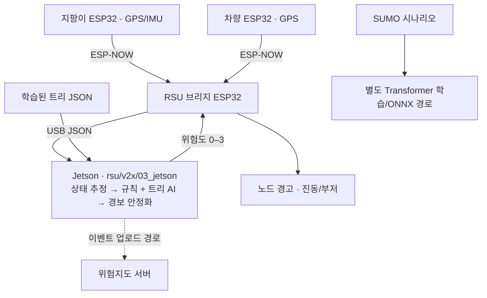
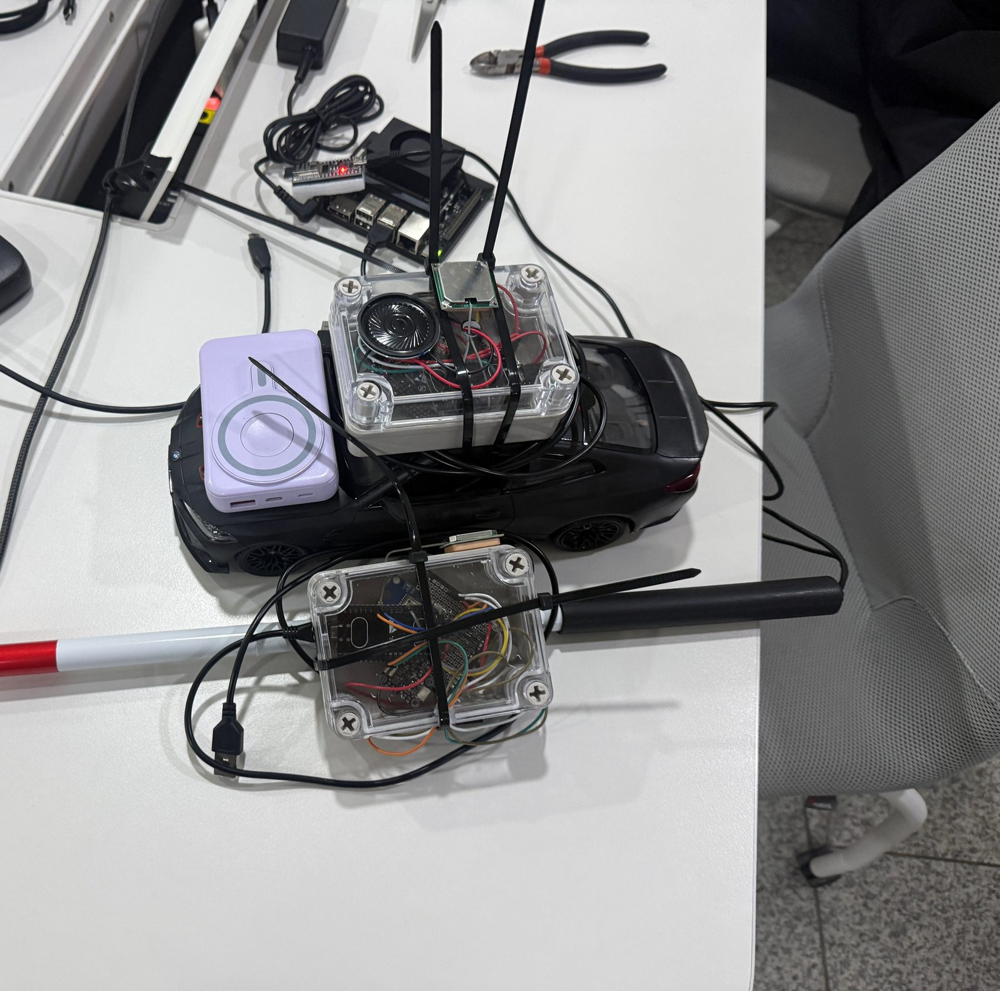
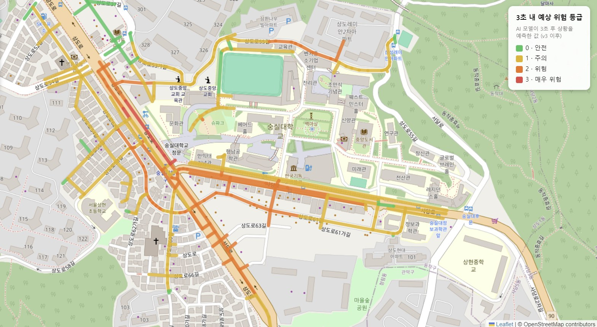
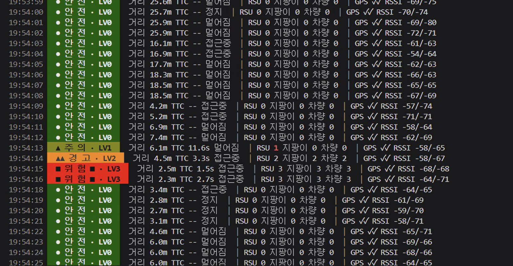
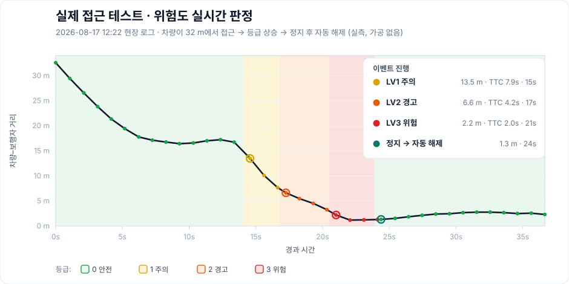

# 🦯 AI-V2X Smart Cane

**AI 기반 V2X 협력형 시각장애인 보행 안전 지팡이 접근하는 차량을 실시간으로 감지해 진동·부저로 경고합니다.**

     

🇺🇸 [English version](README.md)

지팡이와 주변 차량이 각자 GPS 위치를 ESP-NOW로 10Hz 브로드캐스트하면, 노변 장치(RSU)가 이를 모아 NVIDIA Jetson에 전달합니다. Jetson은 칼만 필터 기반 거리·TTC·DCPA로 충돌 위험도(0~3)를 판정해 지팡이로 되돌려 보내고, 지팡이는 등급별 진동·부저 패턴으로 사용자에게 경고합니다. 사용자 쪽에는 스마트폰도, 네트워크 연결도 필요 없습니다.

**한이음 ICT 멘토링** 프로젝트로 4인 팀이 개발했습니다.

## 시스템 아키텍처

```mermaid
flowchart TB
    CANE["지팡이 ESP32 · GPS/IMU"] -- "ESP-NOW" --> RSU["RSU 브리지 ESP32"]
    CAR["차량 ESP32 · GPS"] -- "ESP-NOW" --> RSU
    RSU -- "USB JSON" --> JETSON["Jetson · rsu/v2x/03_jetson<br/>상태 추정 → 규칙 + 트리 AI → 경보 안정화"]
    MODEL["학습된 트리 JSON"] --> JETSON
    JETSON -- "위험도 0–3" --> RSU
    RSU --> FB["노드 경고 · 진동/부저"]
    JETSON -. "이벤트 업로드 경로" .-> MAP["위험지도 서버"]
    SUMO["SUMO 시나리오"] --> TRANSFORMER["별도 Transformer 학습/ONNX 경로"]
```

현재 확인한 현장 경보 경로는 `rsu/v2x/03_jetson/`입니다. `lux/`의 ONNX 경로와 구별합니다. 통신은 **ESP-NOW 기반 V2X 개념 시제품**이며, 표준 C-V2X/DSRC 상호운용 완료를 뜻하지 않습니다.

## 위험도 판정 방식

현장 엔진은 상태 추정·규칙 판정에 **학습된 트리 모델의 경보 상향**을 더합니다.

1. **규칙 판정** — 칼만 필터 기반 거리·접근속도·TTC·DCPA, 점수표, 근접 안전하한과 평행 통과 억제 조건을 사용합니다.
2. **AI 경보 상향** — `ModelGate`가 15개 궤적 특징을 JSON 트리 앙상블에 입력합니다. 모델 점수가 문턱 이상이고 규칙 등급이 2 미만이면 2로 올리며, 규칙이 올린 등급을 내리지 않습니다.
3. **안정화·송신** — 등급 유지와 입력 신뢰 조건을 적용하고, 변화 시 및 heartbeat로 전송합니다. 사용 가능한 보정 UWB 입력이 있으면 별도 대체 경로도 사용합니다.

모델 적재·추론 실패 시 규칙 경로로 복귀합니다. 다만 두 경로가 위치 입력을 공유하므로 센서 오류까지 독립적으로 해결하는 안전 보장은 아닙니다. 정적 구역 정의는 저장소에 있지만, 이 실행 경로의 `zone_base_risk`는 기본 0입니다.

| 등급 | 의미 | 지팡이 피드백 |
| --- | --- | --- |
| 0 | 경보 없음 | 없음 |
| 1 | 주의 | 1.5초 간격 짧은 진동 |
| 2 | 경고 | 빠른 진동 + 부저 펄스 |
| 3 | 위험 | 연속 진동 + 부저 |

**0은 항상 ‘안전 확인’을 뜻하지 않습니다.** 입력 신뢰가 부족하거나 수신 공백이 상한을 넘으면 송신 등급이 0이 될 수 있습니다. 화면의 신뢰·갱신 상태도 함께 확인해야 합니다.

## AI 모델

**현장 경보에 AI를 사용합니다.** 실행 래퍼는 기본적으로 모델을 적재하며, `V2X_NO_MODEL=1` 또는 `--no-model`로 비활성화할 수 있습니다. 초기 일부 시험의 AI OFF 상태를 전체 현재 상태로 설명하던 문구를 정정했습니다.

- **실제 사용 근거:** 2026-09-19 공개 로그의 유효 송신 기록 11,951행 중 **39행이 `level_source=model`**입니다. 변화 송신 9행과 heartbeat 30행이며, 독립 위험 검출 39건이나 사고 예방 횟수가 아닙니다.
- **현장용 트리 모델:** 기본 `risk_model.json`은 91트리입니다. 별도로 저장된 v2 `risk_model_streams_12k.json`은 200트리·문턱 약 0.9079입니다. 기본 파일과 배포 모델을 동일시하지 않고 실행 옵션·모델 지문·세션을 함께 기록해야 합니다.
- **별도 Transformer 경로:** `AI_Model/`에는 10프레임 × 11특징의 Transformer 학습·ONNX 산출물이 있습니다. 기존 테스트 보고서의 accuracy 99.3%, macro F1 0.898은 해당 데이터셋 결과이며, 현장 트리 모델의 정확도나 실도로 안전 성능이 아닙니다. [원본 지표](AI_Model/transformer/models/training_report.txt)

**코드·로그 근거와 재현 방법: [현재 AI 운용 상태](docs/current-ai-status.md).** 최신 확인 기록은 9월 19일이며, 이 문서가 장비의 현재 실행 상태를 실시간으로 확인하는 것은 아닙니다.

## 저장소 구조

| 경로 | 역할 |
| --- | --- |
| [`arduino/`](arduino/) | ESP32 펌웨어 — 지팡이 / 차량 / RSU 브리지 / 피드백 노드 ([코드 맵](arduino/README.md)) |
| [`rsu/v2x/03_jetson/`](rsu/v2x/03_jetson/) | 현장 step8 엔진, 트리 모델, 배포 래퍼 |
| [`lux/`](lux/) | 별도 패키지형 엔진 및 ONNX 추론 경로, 단위 테스트 포함 |
| [`AI_Model/`](AI_Model/) | Transformer 학습, ONNX 변환, 학습된 모델 |
| [`scripts/`](scripts/) | SUMO 출력 → zone / 위험도 / 이벤트 라벨링 파이프라인 (점수표 정본) |
| [`dataset/`](dataset/) | 시나리오별 라벨 데이터셋 (총 78,853 프레임) |
| [`zones/`](zones/) | 정적 위험구역 정의 |
| [`Simulation/`](Simulation/) | SUMO / netedit 작업 기록 |
| [`v2x-server/`](v2x-server/) | 위험지도 웹 서버 (FastAPI + PostgreSQL + Leaflet, Cloud Run 배포형) |
| [`python/`](python/) | 초기 Jetson 프로토타입 (`lux/`로 대체됨) |
| [`docs/`](docs/) | 수행계획서, 회의록, 인수인계 문서 |

## 하드웨어

ESP32 DevKitC (WROOM-32D) ×3 · NEO-6M GPS · ICM-20948 9축 IMU · 진동모터 + 부저 · DFPlayer Mini · **NVIDIA Jetson Orin Nano Super**

*야외 실험 장비 — 차량 노드는 RC카에 싣고(실차의 속도 스케일 대역), 지팡이 노드는 흰지팡이에 장착, 뒤편에서 젯슨 RSU가 실시간 판정을 돌린다.*

## 현장 데모

| 위험지도 화면 | 접근 실험 중 실시간 판정 모니터 |
| --- | --- |
|  |  |

*왼쪽: 위험지도 서버(Leaflet)의 도로별 위험 등급 표시. 화면만으로 현장 3초 선행 예측 성능이 입증되는 것은 아닙니다. 오른쪽: 야외 접근 실험 중 젯슨 실시간 모니터 — 차량이 다가오며 무경보(LV0)에서 주의(LV1)·경고(LV2)·위험(LV3)까지 오르고, 지나가면 다시 해제된다.*

[실차·이동 보행자 시연 영상](https://www.youtube.com/watch?v=Auj-7gjxO64)에는 양측 경고와 주행 장면이 포함됩니다. 위 RC카 사진은 초기 실험 장비입니다.

## 현장 결과 (실측 데이터)

실험실 숫자가 아니라 **실제 도로 로그**로 검증했습니다. 아래는 2026-08-17 접근 한 건 — 차량이 32 m에서 다가오며 판정이 어떻게 오르내리는지 그대로입니다(가공 없음). TTC가 2초 아래로 떨어진 순간 안전하한 규칙이 즉시 위험(LV3)을 내보낸 게 로그에 찍혀 있습니다.

7일 47개 세션 **104,511건**의 판정을 모으면 가까울수록 경고 등급이 실제로 올라갑니다.

**→ 거리별 분포·현장 개선점·재현 방법: [현장 결과 전체 보기](docs/field-results.ko.md)**

## 설치 및 실행

펌웨어 업로드 순서, Wi-Fi 설정, 핀맵: [docs/SETUP.ko.md](docs/SETUP.ko.md)

## 로드맵

- 시연 세션·코드·모델 지문·실행 설정을 묶어 재현 가능한 배포 기록 정리
- 독립 현장 사건 단위로 미경보·불필요 경보·최초 경보 여유시간 검증
- 입력 부족 상태와 정상 무경보의 장치·화면 표현 검증
- 위험지도 값의 실시간 판정 연계, 다중 노드 개별 경고 및 표준 V2X 연동 확장

## 팀

| 팀원 | 역할 |
| --- | --- |
| **강현준** ([@joon722](https://github.com/joon722)) | **통신·시스템 통합 — ESP-NOW, Jetson UART, `lux/` 실시간 파이프라인** |
| 최민서 | AI·데이터·클라우드 — SUMO 시뮬레이션, 라벨링, Transformer 학습, 위험지도, 클라우드 서버 연동(Cloud Run)  |
| 박채린 | 웹 — 홈페이지(실시간 차량뷰 `drive.html`)|
| 박중선 | 하드웨어 — 센서/액추에이터 회로, 전원, 기구 |
