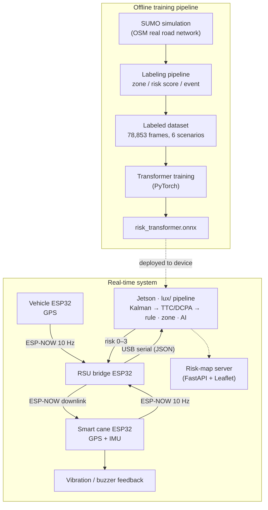

<div align="center">

# 🦯 AI-V2X Smart Cane

**An AI-powered V2X smart cane that warns visually impaired pedestrians<br/>of approaching vehicles in real time.**

     

🇰🇷 [한국어 문서 (Korean version)](README.ko.md)

</div>

The cane and nearby vehicles each broadcast their GPS position over ESP-NOW at 10 Hz. A roadside unit (RSU) relays every packet to an NVIDIA Jetson, which estimates collision risk (distance, TTC, DCPA via Kalman filtering) and sends a risk level (0–3) back to the cane. The cane alerts the user through distinct vibration and buzzer patterns — no smartphone or network connection required on the user's side.

Built by a 4-person team for the **Hanium ICT Mentoring program**.

## System architecture



## How risk is decided

The Jetson-side pipeline (`lux/`) computes three independent risk sources and takes the **maximum** — if any one path fails, the warning still fires (fail-safe design).

1. **Rule-based scoring** — Kalman-filtered distance, closing speed, TTC, and DCPA feed a 100-point score table (distance 30 + TTC 35 + relative speed 20 + vehicle speed 10 + zone 5). Cutoffs: ≥70 → level 3, ≥45 → 2, ≥20 → 1.
2. **Static danger zones** — 4 campus hotspots (main gate, blind intersection, parking exit, …) defined as 30 m-radius circles that raise the baseline risk by location alone.
3. **AI inference** — an on-device ONNX Transformer classifies the last 10 frames of pedestrian–vehicle trajectory into risk levels 0–3. If the model or runtime is unavailable, the slot silently falls back and rule + zone keep the system fully functional.

Outgoing risk passes **trust gating** (no GPS fix → non-zero risk suppressed) and **rate limiting** (send on change + heartbeat) before returning to the cane.

| Level | Meaning | Cane feedback |
| --- | --- | --- |
| 0 | Normal | off |
| 1 | Caution | short vibration every 1.5 s |
| 2 | Warning | fast vibration + buzzer pulses |
| 3 | Danger | continuous vibration + buzzer |

## AI model

A lightweight sequence classifier small enough for on-device inference (ONNX ≈ 325 KB):

```
Linear(11 → 64) → TransformerEncoder(2 layers, d_model 64, 4 heads, FFN 128)
                → last frame → LayerNorm → Linear(64 → 4 classes)
```

- Input: 10-frame window × 11 features (positions, speeds, distance, TTC, rule score, zone risk), z-score normalized
- Trained on 12,621 labeled frames from 6 SUMO scenarios with class-weighted cross-entropy (danger frames are only 0.24 % of the data)
- Test set (2,523 sequences): **accuracy 99.3 %, macro F1 0.898** — macro F1 is the honest headline figure given the heavy class imbalance
- Full metrics: [`AI_Model/transformer/models/training_report.txt`](AI_Model/transformer/models/training_report.txt)

**Known limitation (documented on purpose):** the current training data keeps the pedestrian stationary, so the AI slot is disabled by default in field operation until the model is retrained on moving-pedestrian scenarios. Rule + zone paths carry the safety function in the meantime.

## Repository structure

| Path | Role |
| --- | --- |
| [`arduino/`](arduino/) | ESP32 firmware — cane / vehicle / RSU bridge / feedback nodes ([code map](arduino/README.md)) |
| [`lux/`](lux/) | Jetson real-time risk engine: parse → state → kinematics → scoring → downlink, with hardware-free unit tests |
| [`AI_Model/`](AI_Model/) | Transformer training, ONNX export, trained models |
| [`scripts/`](scripts/) | SUMO output → zone / risk / event labeling pipeline (source of truth for the score table) |
| [`dataset/`](dataset/) | Labeled scenario datasets (78,853 frames total) |
| [`zones/`](zones/) | Static danger-zone definitions |
| [`Simulation/`](Simulation/) | SUMO / netedit work logs |
| [`v2x-server/`](v2x-server/) | Risk-map web server (FastAPI + PostgreSQL + Leaflet, Cloud Run deployable) |
| [`python/`](python/) | Early Jetson prototype (superseded by `lux/`) |
| [`docs/`](docs/) | Project plans, meeting notes, handover documents |

## Hardware

ESP32 DevKitC (WROOM-32D) ×3 · NEO-6M GPS · ICM-20948 9-axis IMU · vibration motor + buzzer · DFPlayer Mini · **NVIDIA Jetson Orin Nano Super**


*Field-test rig — the vehicle node rides on an RC car (a speed-scaled stand-in for a real vehicle), the cane node sits on the white cane, and the Jetson RSU runs in the background.*

## Field demo

| AI risk map (3 s-ahead prediction) | Live risk monitor during an approach test |
| --- | --- |
|  |  |

*Left: per-road risk levels predicted 3 seconds ahead, rendered by the risk-map server (Leaflet). Right: the Jetson's live monitor during a field run — safe (LV0) escalates through caution (LV1) and warning (LV2) to danger (LV3) as the vehicle closes in, then clears once it passes.*

## Field results (real data)

Not lab numbers — verified on **real road logs.** Below is one approach from 2026-08-17: a vehicle closes from 32 m and the risk level climbs and clears on its own (no hand-editing). The log shows the safety-floor rule forcing Danger (LV3) the instant time-to-collision drops below 2 s.


Aggregate **104,511** decisions from 7 days / 47 sessions, and the warning rate rises as the vehicle gets closer.

**→ Distance breakdown, field fixes, and reproduction: [full field results](docs/field-results.md)**

## Getting started

Firmware upload order, Wi-Fi configuration, and pin maps: [docs/SETUP.ko.md](docs/SETUP.ko.md) (Korean).

## Roadmap

- Integrate the real-time risk-fusion runner (in progress on `feat/lux-fusion-zone`)
- Unify the three coordinate systems (live GPS / SUMO local / risk-map) and retrain the model with moving-pedestrian data
- Connect the risk-event upload client to the risk-map server
- Vehicle-side HMI (LCD / LED warning) and V2I traffic-signal extension

## Team

| Member | Role |
| --- | --- |
| **강현준** ([@joon722](https://github.com/joon722)) | **Communications & system integration — ESP-NOW, Jetson UART, `lux/` real-time pipeline** |
| 최민서 | AI & data — SUMO simulation, labeling, Transformer training, risk map |
| 박채린 | Web & cloud — website (live vehicle view `drive.html`), cloud server integration (Cloud Run) |
| 박중선 | Hardware — sensor/actuator circuits, power, enclosure |
