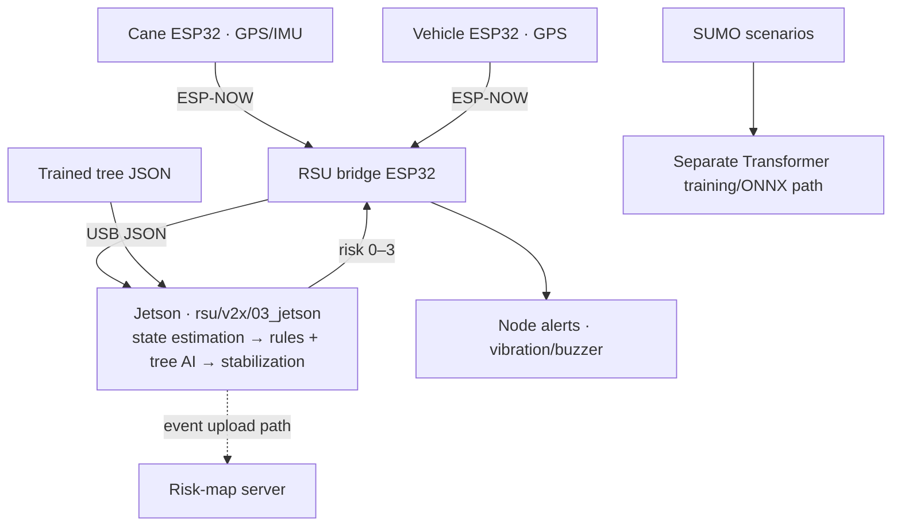

# 🦯 AI-V2X Smart Cane

**An AI-powered V2X smart cane that warns visually impaired pedestrians of approaching vehicles in real time.**

     

🇰🇷 [한국어 문서 (Korean version)](README.ko.md)

The cane and nearby vehicles each broadcast their GPS position over ESP-NOW at 10 Hz. A roadside unit (RSU) relays every packet to an NVIDIA Jetson, which estimates collision risk (distance, TTC, DCPA via Kalman filtering) and sends a risk level (0–3) back to the cane. The cane alerts the user through distinct vibration and buzzer patterns — no smartphone or network connection required on the user's side.

Built by a 4-person team for the **Hanium ICT Mentoring program**.

## System architecture

```mermaid
flowchart TB
    CANE["Cane ESP32 · GPS/IMU"] -- "ESP-NOW" --> RSU["RSU bridge ESP32"]
    CAR["Vehicle ESP32 · GPS"] -- "ESP-NOW" --> RSU
    RSU -- "USB JSON" --> JETSON["Jetson · rsu/v2x/03_jetson<br/>state estimation → rules + tree AI → stabilization"]
    MODEL["Trained tree JSON"] --> JETSON
    JETSON -- "risk 0–3" --> RSU
    RSU --> FB["Node alerts · vibration/buzzer"]
    JETSON -. "event upload path" .-> MAP["Risk-map server"]
    SUMO["SUMO scenarios"] --> TRANSFORMER["Separate Transformer training/ONNX path"]
```

The reviewed field-alert path is `rsu/v2x/03_jetson/`, distinct from the ONNX path in `lux/`. This is an **ESP-NOW V2X concept prototype**; standard C-V2X/DSRC interoperability has not been established.

## How risk is decided

The field engine combines state estimation and rules with **alarm upgrades from a trained tree model**.

1. **Rules** — Kalman-based distance, closing speed, TTC and DCPA, scoring, proximity safety floors, and parallel-pass suppression.
2. **AI alarm upgrades** — `ModelGate` feeds 15 trajectory features to a JSON tree ensemble. When the model score meets its threshold and the rule level is below 2, it raises the level to 2. It does not lower a rule-generated level.
3. **Stabilization and transmission** — level holding and input-trust conditions precede change-triggered and heartbeat transmissions. A separate fallback path can use available, calibrated UWB measurements.

Model loading or inference failures fall back to rules. Both paths share position inputs, so this is not an independent guarantee against sensor faults. Static zone definitions exist, but `zone_base_risk` remains at its default of 0 in this runner.

| Level | Meaning | Cane feedback |
| --- | --- | --- |
| 0 | No alert | off |
| 1 | Caution | short vibration every 1.5 s |
| 2 | Warning | fast vibration + buzzer pulses |
| 3 | Danger | continuous vibration + buzzer |

**Level 0 does not always mean verified safety.** Insufficient input trust or a reception gap beyond the hold limit can result in transmitted level 0. Check the accompanying trust and freshness status.

## AI model

**AI is used in the field-alert pipeline.** The launch wrapper loads a model by default; `V2X_NO_MODEL=1` or `--no-model` disables it. The earlier blanket statement that field AI was disabled has been corrected.

- **Observed use:** the public September 19, 2026 log contains **39 `level_source=model` rows** among 11,951 valid transmission records: 9 change-triggered rows and 30 heartbeats. These are not 39 independent detections or prevented accidents.
- **Field tree models:** the default `risk_model.json` contains 91 trees. The separately stored v2 `risk_model_streams_12k.json` contains 200 trees with a threshold of approximately 0.9079. Record the model fingerprint, launch options and session together; the default file and deployed artifact must not be assumed identical.
- **Separate Transformer path:** `AI_Model/` contains Transformer training and ONNX artifacts using 10 frames × 11 features. Its existing test report (accuracy 99.3%, macro F1 0.898) describes that dataset, not the field tree model or real-road safety performance. [Original metrics](AI_Model/transformer/models/training_report.txt)

**Code, log evidence and reproduction: [current AI operating status](docs/current-ai-status.md).** The latest reviewed field record is September 19; this documentation is not a live check of the device's current process.

## Repository structure

| Path | Role |
| --- | --- |
| [`arduino/`](arduino/) | ESP32 firmware — cane / vehicle / RSU bridge / feedback nodes ([code map](arduino/README.md)) |
| [`rsu/v2x/03_jetson/`](rsu/v2x/03_jetson/) | Field step8 engine, tree model and deployment wrapper |
| [`lux/`](lux/) | Separate packaged engine and ONNX inference path, with hardware-free unit tests |
| [`AI_Model/`](AI_Model/) | Transformer training, ONNX export, trained models |
| [`scripts/`](scripts/) | SUMO output → zone / risk / event labeling pipeline (source of truth for the score table) |
| [`dataset/`](dataset/) | Labeled scenario datasets (78,853 frames total) |
| [`zones/`](zones/) | Static danger-zone definitions |
| [`Simulation/`](Simulation/) | SUMO / netedit work logs |
| [`v2x-server/`](v2x-server/) | Risk-map web server (FastAPI + PostgreSQL + Leaflet, Cloud Run deployable) |
| [`python/`](python/) | Early Jetson prototype (superseded by `lux/`) |
| [`docs/`](docs/) | Project plans, meeting notes, handover documents |

## Hardware

ESP32 DevKitC (WROOM-32D) ×3 · NEO-6M GPS · ICM-20948 9-axis IMU · vibration motor + buzzer · DFPlayer Mini · **NVIDIA Jetson Orin Nano Super**

*Field-test rig — the vehicle node rides on an RC car (a speed-scaled stand-in for a real vehicle), the cane node sits on the white cane, and the Jetson RSU runs in the background.*

## Field demo

| Risk-map display | Live risk monitor during an approach test |
| --- | --- |
|  |  |

*Left: per-road risk levels rendered by the risk-map server (Leaflet); the display alone does not establish 3-second-ahead field prediction performance. Right: the Jetson's live monitor during a field run — no alert (LV0) escalates through caution (LV1) and warning (LV2) to danger (LV3) as the vehicle closes in, then clears once it passes.*

[The real-car / moving-pedestrian demonstration](https://www.youtube.com/watch?v=Auj-7gjxO64) includes alerts on both sides and driving scenes. The RC-car photo above shows the earlier test rig.

## Field results (real data)

Not lab numbers — verified on **real road logs.** Below is one approach from 2026-08-17: a vehicle closes from 32 m and the risk level climbs and clears on its own (no hand-editing). The log shows the safety-floor rule forcing Danger (LV3) the instant time-to-collision drops below 2 s.

Aggregate **104,511** decisions from 7 days / 47 sessions, and the warning rate rises as the vehicle gets closer.

**→ Distance breakdown, field fixes, and reproduction: [full field results](docs/field-results.md)**

## Getting started

Firmware upload order, Wi-Fi configuration, and pin maps: [docs/SETUP.ko.md](docs/SETUP.ko.md) (Korean).

## Roadmap

- Package session, code, model fingerprint and launch settings into reproducible deployment records
- Validate missed events, unnecessary alarms and first-alert lead time on independently labeled field events
- Verify device/UI handling of insufficient input versus normal no-alert operation
- Extend risk-map feedback into decisions, per-node multi-user alerts, and standard V2X integration

## Team

| Member | Role |
| --- | --- |
| **강현준** ([@joon722](https://github.com/joon722)) | **Communications & system integration — ESP-NOW, Jetson UART, `lux/` real-time pipeline** |
| 최민서 | AI & data — SUMO simulation, labeling, Transformer training, risk map |
| 박채린 | Web & cloud — website (live vehicle view `drive.html`), cloud server integration (Cloud Run) |
| 박중선 | Hardware — sensor/actuator circuits, power, enclosure |
