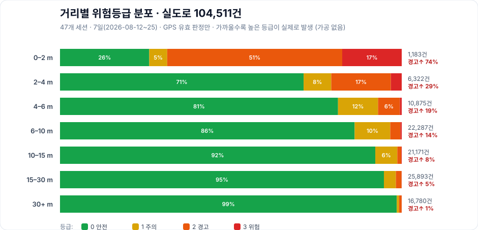

# 현장 결과 · Field Results

> 🇺🇸 [English version](field-results.md) · 메인 문서로 [← README.ko.md](../README.ko.md)

실험실 숫자가 아니라 **실제 도로에서 기록한 로그**로 이 시스템이 어떻게 동작하는지 보여줍니다.
아래 그림은 모두 [`data/`](../data/)의 원본 CSV에서 **가공 없이** 생성했으며, 생성 스크립트도 함께 올려 두었습니다.

- 기간: **2026-08-12 ~ 08-25 (7일, 47개 세션)**
- 근거 데이터: GPS 유효 판정 **104,511건**, 추출된 접근 이벤트 **95건**
- 장소: 캠퍼스 인도–도로 경계 (차량 노드는 RC카에 탑재한 속도 축소 대역)

---

## 1. 실시간 위험 판정 — 실제 접근 한 건을 초 단위로

**2026-08-17 12:22 세션의 접근 한 건**입니다. 차량이 32 m에서 다가오기 시작해 지팡이 옆을 스치기까지, 판정이 어떻게 올라갔다 내려오는지 그대로입니다.

| 시각 | 거리 | TTC | 판정 | 근거 |
| ---: | ---: | ---: | :--- | :--- |
| 0.0 s | 32.6 m | 10.8 s | **0 안전** | 아직 멀고 접근 중 |
| ~8–12 s | ~16 m | — | **0 안전** | 잠깐 멈춤(접근 속도 ≈ 0) → DCPA 게이트가 경보 억제 |
| 14.6 s | 13.5 m | 7.9 s | **1 주의** | 다시 접근, 점수 20 도달 |
| 17.3 s | 6.6 m | 4.3 s | **2 경고** | 점수 45 도달 |
| 21.0 s | 2.2 m | **1.97 s** | **3 위험** | **안전하한**: TTC가 2초 이하로 떨어지자 점수와 무관하게 즉시 최고 등급 |
| 24.4 s | 1.3 m | — | **0 안전** | 차량 정지(접근 속도 ≈ 0) → 자동 해제 |

핵심은 **21.0 s의 위험 판정**입니다. 이때 규칙 점수는 63점으로 아직 경고(2등급) 구간이었지만, **충돌예상시간(TTC)이 1.97초로 떨어지자 "안전하한(safety-floor)" 규칙이 등급을 곧바로 위험(3)으로 끌어올렸습니다.** 점수표만 믿지 않고, 시간이 임박하면 무조건 최고 경고를 내보내는 안전 우선 설계가 실제 로그에 그대로 찍혀 있습니다.

---

## 2. 10만 건으로 본 "가까울수록 위험" — 실도로 검증

접근 한 건은 우연일 수 있으니, **7일 47개 세션의 GPS 유효 판정 104,511건 전체**를 거리 구간별로 집계했습니다.

| 거리 | 판정 수 | 경고(1등급 이상) 비율 |
| ---: | ---: | ---: |
| 0–2 m | 1,183 | **73.9 %** |
| 2–4 m | 6,322 | 28.7 % |
| 4–6 m | 10,875 | 18.6 % |
| 6–10 m | 22,287 | 13.8 % |
| 10–15 m | 21,171 | 7.7 % |
| 15–30 m | 25,893 | 5.2 % |
| 30+ m | 16,780 | 1.4 % |

거리가 가까워질수록 경고 비율이 **단조롭게** 올라갑니다 — 규칙을 하나하나 검증한 게 아니라, 10만 건의 실제 판정이 스스로 "가까우면 경고, 멀면 조용"이라는 설계 의도를 보여줍니다.

> **정직하게:** 15 m 이상 먼 거리에도 소수의 경고(5.2 %, 1.4 %)가 남아 있습니다. 이는 GPS 잡음과 TTC 기반 조기경보에서 오는 것으로, 현장에서 확인해 아래 3절처럼 게이트를 조여 줄여 왔습니다. 숨기지 않고 그대로 집계에 포함했습니다.

---

## 3. 현장에서 배우고 고친 것

숫자만 쌓은 게 아니라, 매 실험마다 실패를 찾아 고쳤습니다.

- **DCPA 게이트 조이기 (7.5 m → 4.5 m).** 인도–도로 간격을 직접 실측(3–10 m, 좁은 곳 3 m)한 근거로, 스쳐 지나가는 평행 주행을 오경보로 잡던 문턱을 낮췄습니다. 재생 검증에서 실접근 검출은 유지(−1건)하면서 유휴 오경보를 약 20 % 줄였습니다.
- **UWB — GPS 공백 안전망 (8/25 야외 첫 성공).** 지팡이 GPS가 내내 잡히지 않은 세션에서, UWB 거리 측정이 판정을 100 % 대신 살려 LV1–LV3까지 정상적으로 내보냈습니다. GPS만 썼다면 완전 먹통이었을 상황을 UWB가 메운 설계 목적이 실증됐습니다.
- **AI 판단은 정직하게 꺼 둔다.** 온디바이스 Transformer 모델은 시뮬레이션에서 규칙을 앞섰지만(+8.9 %p), 실도로 로그 재생 채점에서는 규칙과 대등했습니다. **확실한 이득이 실도로에서 검증되기 전까지 시연·운영에서 모델을 끄고**, 규칙 + 위험구역만으로 안전 기능을 완결시켰습니다. 성능 숫자보다 안전을 앞세운 판단입니다.
- **3중 안전 설계(fail-safe).** 규칙 점수 · 정적 위험구역 · AI 세 경로의 **최댓값**을 채택합니다. 한 경로가 실패해도 경고는 사라지지 않습니다.

---

## 4. 데이터 & 재현

- 원본 로그: [`data/`](../data/) — 날짜별 세션 폴더(무엇을 담고 있는지는 [data/README.md](../data/README.md) 참고)
- 판정 결과 CSV: 각 세션의 `risk_tx_*.csv` (거리·TTC·접근속도·등급·GPS·모델 확률 포함)
- 이 페이지의 그림 생성 스크립트: [`scripts/figures/`](../scripts/figures/) — 같은 CSV로 SVG를 다시 만들 수 있습니다.

> **방법 주의:** 위 1·2절은 **실측 로그**입니다(현장에서 그 순간 나온 판정). AI 비교(3절)는 같은 로그를 모델에 다시 통과시키는 **재생 채점**으로, 실측과 구분해 표기했습니다.
